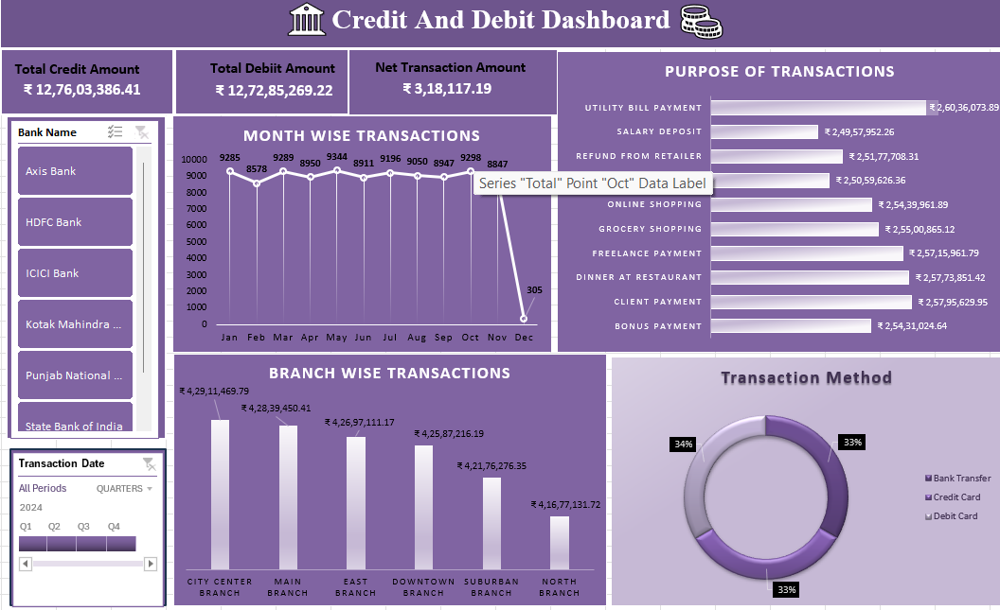
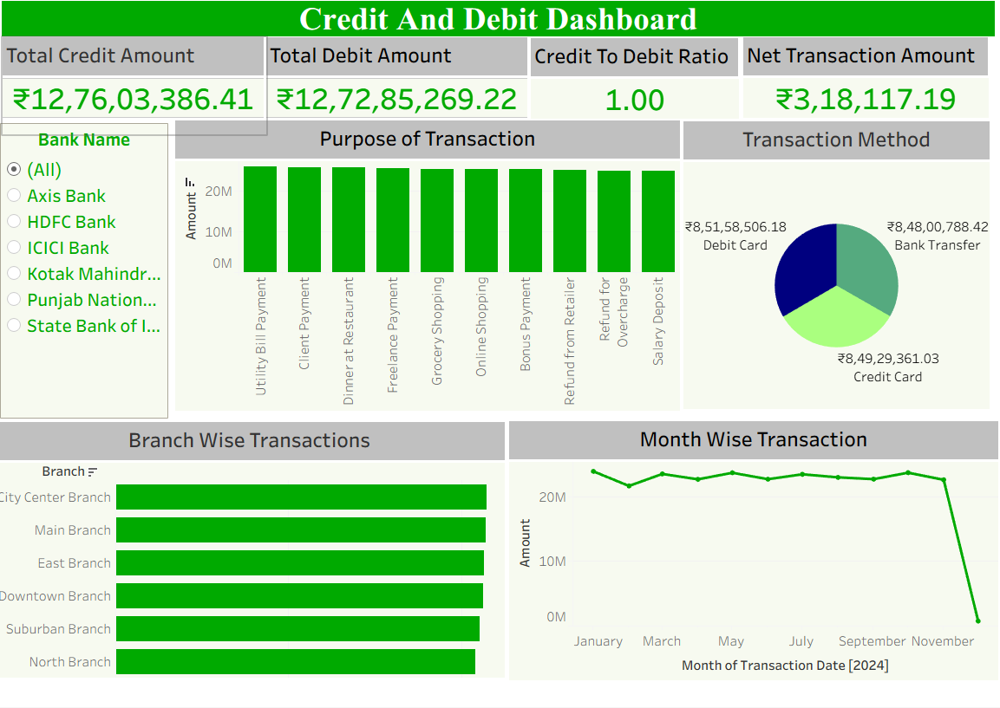

# Banking Analytics

### End-to-End Banking Data Analytics & Business Intelligence Project

An end-to-end **Banking Analytics** project focused on analyzing **Bank Loan** and **Credit & Debit** datasets using **SQL, Microsoft Excel, Power BI, and Tableau**.

The project transforms banking data into meaningful KPIs, analytical insights, and interactive dashboards to understand loan portfolio performance, customer and geographic patterns, and credit/debit transaction activity.

---
# Project Overview

Banking Analytics is a data analytics and business intelligence project designed to analyze two important areas of banking operations:

### Bank Loan Analytics

Analyzes loan portfolio performance, loan status, geographic distribution, customer age groups, loan purposes, products, and monthly trends.

### Credit & Debit Analytics

Analyzes banking transaction activity, credit and debit amounts, transaction purposes, transaction methods, branch-level activity, and monthly transaction trends.

The project applies the same analytical concepts across **SQL, Excel, Power BI, and Tableau**, providing multiple perspectives for exploring and communicating banking data.

---
# Business Problem

Banking institutions generate large volumes of financial and customer-related data. Converting this data into useful business information requires structured analysis and effective visualization.

This project addresses key analytical questions such as:

- How is the loan portfolio performing?
- What is the overall loan amount and funded amount?
- How are loans distributed across different states and regions?
- Which customer age groups contribute to loan activity?
- What are the major loan purposes and products?
- How is the loan portfolio distributed by loan status?
- How does loan activity change over time?
- What is the relationship between credit and debit transaction activity?
- Which transaction purposes contribute most to transaction activity?
- Which transaction methods are commonly used?
- How does transaction activity vary across branches?
- What are the monthly trends in banking transactions?

---
# Project Objectives

The primary objectives of this project are to:

- Analyze overall bank loan portfolio performance.
- Monitor important loan-related KPIs.
- Analyze loan status and portfolio composition.
- Examine loan distribution across states and regions.
- Analyze loan activity across customer age groups.
- Identify major loan purposes and products.
- Analyze monthly loan trends.
- Analyze credit and debit transaction activity.
- Compare total credit and debit amounts.
- Analyze transaction purpose and transaction methods.
- Analyze branch-wise transaction activity.
- Identify monthly transaction trends.
- Develop interactive dashboards for business reporting.
- Present analytical findings through multiple BI and visualization platforms.

---

# Datasets Used

The project consists of two primary banking datasets.

---

## 1. Bank Loan Dataset

The Bank Loan dataset is used to analyze loan portfolio performance and understand different dimensions of loan activity.

### Key analytical areas

- Loan Amount
- Funded Amount
- Interest Rate
- Installment Amount
- Loan Count
- Loan Status
- Loan Purpose
- Loan Product
- Customer Age
- State
- Region
- Monthly Loan Activity

---

## 2. Credit & Debit Dataset

The Credit & Debit dataset is used to analyze banking transaction activity and understand credit and debit patterns.

### Key analytical areas

- Credit Amount
- Debit Amount
- Credit-to-Debit Ratio
- Transaction Count
- Average Transaction Amount
- Transaction Purpose
- Transaction Method
- Branch
- Monthly Transaction Activity

---

# Tools & Technologies

| Tool | Purpose |
|---|---|
| **SQL** | Data querying, aggregation, filtering, KPI calculations and analysis |
| **Microsoft Excel** | Data analysis, KPI reporting and dashboard development |
| **Power BI** | Interactive business intelligence and dashboard development |
| **Tableau** | Interactive visualization and business reporting |

---

# Analytics Workflow

The project follows an end-to-end data analytics workflow:

```text
Banking Datasets
       ↓
Data Understanding
       ↓
Data Preparation
       ↓
SQL Analysis
       ↓
KPI Calculation
       ↓
Exploratory Analysis
       ↓
Dashboard Development
       ↓
Interactive Visualization
       ↓
Business Insights

---

# Dashboard Features

## Bank Loan Dashboard
- Total Loan Amount: Tracks the overall value of loans issued.
- Average Interest Rate: Monitors the average interest rate across loans.
- Principal Recovered: Shows the total principal amount recovered.
- Interest Recovered: Tracks interest collected from customers.
- Default Loan Count: Identifies the number of defaulted loans.
- Delinquent Client Count: Monitors customers with delinquent loans.
- State-wise Loan Analysis: Compares loan exposure across different states.
- Age-wise Loan Analysis: Analyzes loan distribution across customer age groups.
- Purpose-wise Loan Analysis: Identifies major reasons for taking loans.
- Product-wise Loan Analysis: Compares loan amounts across different products.
- Branch-wise Revenue Analysis: Evaluates revenue generated by branches.
- Loan Status Analysis: Tracks Active, Closed, Default, and other loan statuses.
- Loan Term Analysis: Compares loans based on their repayment terms.

---

# Project Structure

The project is organized into the following sections:

### 1. Dataset
Contains the raw and cleaned banking datasets used for analysis.
- Raw Dataset
- Cleaned Dataset

### 2. SQL Analysis
Contains SQL queries used to clean, transform, and analyze the banking data.
- Data Cleaning Queries
- Loan Analysis Queries
- Transaction Analysis Queries
- KPI Analysis Queries

### 3. Excel Analysis
Contains the Excel workbook used for data analysis and dashboard creation.
- Bank Loan Dashboard
- Credit & Debit Dashboard

### 4. Power BI Analysis
Contains the Power BI report created for interactive banking analytics.
- Bank Loan Dashboard
- Credit & Debit Dashboard
- KPIs
- Interactive Filters
- Data Visualizations

### 5. Tableau Analysis
Contains the Tableau workbook created for interactive data visualization.
- Bank Loan Dashboard
- Credit & Debit Dashboard
- KPIs
- Interactive Filters
- Data Visualizations

### 6. Dashboard Screenshots
Contains screenshots of the dashboards created using Excel, Power BI, and Tableau.
- Excel Dashboard Screenshots
- Power BI Dashboard Screenshots
- Tableau Dashboard Screenshots

---

# Key Insights

## Excel

###Bank Loan Dashboard 


###Credit-Debit Dashboard  


## Power BI

###Bank Loan Dashboard  


### Credit-Debit Dashboard 


## Tableau
###Bank Loan Dashboard  


###Credit-Debit Dashboard  


---

# Author
Srikanth Penumala

# License
This project is licensed under the MIT License.


---

